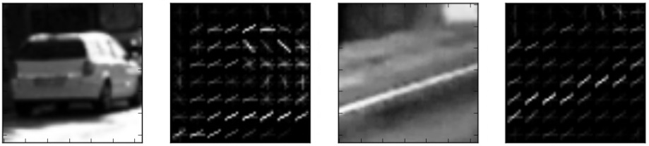

Detecting other vehicles on the road
====================================

The goal was to develop a pipeline to reliably detect cars, given a video from
a roof-mounted camera. For the same, we used two techniques - a Histogram of
Oriented Gradients (HOG) based classifier and a deep neural network, using
*Single Shot Multi-Box Detector*.

Histogram of Oriented Gradients (HOG)
~~~~~~~~~~~~~~~~~~~~~~~~~~~~~~~~~~~~~

Feature Extraction.
^^^^^^^^^^^^^^^^^^^

A *feature* is a compact representation that encodes information that is
relevant for a given task. In our case, features must be informative enough to
distinguish between a *car* and *non-car* image patches as accurately as
possible.

Here is an example of how the ``vehicle`` and ``non-vehicle`` classes
look like in this dataset:

.. figure:: img/noncar_samples.png

   Randomly-samples non-car patches.


   Randomly-samples car patches.

Code
^^^^

All the code referenced here is available at https://github.com/RJ722/sdc

Actual feature extraction is performed by the function ``image_to_features``,
which takes as input an image and the dictionary of parameters, and returns the
features computed for that image. In order to perform batch feature extraction
on the whole dataset (for training), the function
``extract_features_from_file_list`` takes as input a list of images and return a
list of feature vectors, one for each input image.

For the task of car detection, we used *color histograms* and *spatial
features* to encode the object visual appearance and HOG features to
encode the object’s *shape*. 

Choosing HOG parameters
^^^^^^^^^^^^^^^^^^^^^^^

HOG stands for *Histogram of Oriented Gradients* and refer to a powerful
descriptor that has met with a wide success in the computer vision community,
since its introduction in 2005 with the main purpose of people detection.



   Representation of HOG descriptors for a car patch (left) and a non-car
   patch (right).

However, HOG comes along with a *lot* of parameters to tune in
order to work properly. The main parameters are the size of the cell in
which the gradients are accumulated, as well as the number of
orientations used to discretize the histogram of gradients. Furthermore,
one must specify the number of cells that compose a block, on which
later a feature normalization will be performed. Finally, being the HOG
computed on a single-channel image, arises the need of deciding which
channel to use, eventually computing the feature on all channels then
concatenating the result.

In order to select the right parameters, both the classifier accuracy
and computational efficiency are to consider. After various attemps, I
came up to the following parameters that are stored in ``config.py``:

::

   # parameters used in the phase of feature extraction
   feat_extraction_params = {
       'resize_h': 64,             # resize height before feat extraction
       'resize_w': 64,             # resize width before feat extraction
       'color_space': 'YCrCb',     # Can be RGB, HSV, LUV, HLS, YUV, YCrCb
       'orient': 9,                # HOG orientations
       'pix_per_cell': 8,          # HOG pixels per cell
       'cell_per_block': 2,        # HOG cells per block
       'hog_channel': "ALL",       # Can be 0, 1, 2, or "ALL"
       'spatial_size': (32, 32),   # Spatial binning dimensions
       'hist_bins': 16,            # Number of histogram bins
       'spatial_feat': True,       # Spatial features on or off
       'hist_feat': True,          # Histogram features on or off
       'hog_feat': True            # HOG features on or off
   }


Training the classifier
^^^^^^^^^^^^^^^^^^^^^^^

Once decided which features to used, we can train a classifier on these.
In ```train.py``, we trained a linear SVM for task of binary
classification *car* vs *non-car*. First, training data are listed a
feature vector is extracted for each image:

::

       cars = get_file_list_recursively(root_data_vehicle)
       notcars = get_file_list_recursively(root_data_non_vehicle)

       car_features = extract_features_from_file_list(cars, feat_extraction_params)
       notcar_features = extract_features_from_file_list(notcars, feat_extraction_params)

Then, the actual training set is composed as the set of all car and all
non-car features (labels are given accordingly). Furthermore, feature
vectors are standardize in order to have all the features in a similar
range and ease training.

::

       feature_scaler = StandardScaler().fit(X)  # per-column scaler
       scaled_X = feature_scaler.transform(X)

Now, training the LinearSVM classifier is as easy as:

::

       svc = LinearSVC()  # svc = SVC(kernel='rbf')
       svc.fit(X_train, y_train)

In order to have an idea of the classifier performance, we can make a
prediction on the test set with ``svc.score(X_test, y_test)``. Training
the SVM with the features explained above took around 10 minutes on my
laptop.

Sliding Window Search
~~~~~~~~~~~~~~~~~~~~~

We, first of all, implemented a naive sliding window approach in order
to get windows at different scales for the purpose of classification.

This is shown in function ``compute_windows_multiscale`` in
```functions_detection.py``, which in fact turned out to be very slow. We
ultimately implemented a function to jointly search the region of interest and
to classify each window.

The performance boost is due to the fact that HOG features are computed only
once for the whole region of interest, then subsampled at different scales in
order to have the same effect of a multi-scale search, but in a more
computationally efficient way. This function is called ``find_cars`` and
implemented in ``functions_feat_extraction.py``. Of course the *tradeoff* is
evident: the more the search scales and the more the overlap between adjacent
windows, the less performing is the search from a computational point of view.

Optimizing the classifier
^^^^^^^^^^^^^^^^^^^^^^^^^

Whole classification pipelin using CV approach is implemented in
``main_hog.py``. Each test image undergoes through the
``process_pipeline`` function, which is responsible for all phases:
feature extraction, classification and showing the results.

.. figure:: img/pipeline_hog.jpg

   Result of HOG pipeline on one of the test images.

In order to optimize the performance of the classifier, we started the
training with different configuration of the parameters, and kept the
best one. Performing detection at different scales also helped a lot,
even if exceeding in this direction can lead to very long computational
time for a single image. At the end of this pipeline, the whole
processing, from image reading to writing the ouput blend, took about
0.5 second per frame on an i5 processor (Macbook Air) without a GPU.

Using Deep Learning based Method
~~~~~~~~~~~~~~~~~~~~~~~~~~~~~~~~

It turned out that HOG+SVM approach turned out to be poor at generalizing for
different results because it strongly relied on the parameter chosen to perform
feature extraction, training and detection. Even if we found a set of
parameters that more or less worked for the project video, we weren't
satisfied with the results, because parameters were so finely tuned on the
project video that certainly were not robust to different situations.

For this reason, we turned to deep learning, and we leveraged on an
existing detection network (pretrained on Pascal VOC classes) to tackle
the problem. 


SSD (*Single Shot Multi-Box Detector*) network
^^^^^^^^^^^^^^^^^^^^^^^^^^^^^^^^^^^^^^^^^^^^^^

In order to solve the aforementioned problems, we decided to use a deep
network to perform the detection, thus replacing the HOG+SVM pipeline.
For this task employed the recently proposed SSD deep
network <https://arxiv.org/pdf/1512.02325.pdf> for detection. This
paved the way for several huge advantages:

- the network performs detection and classification in a single pass, and
  natively goes in GPU.

- There is no more need to tune and validate hundreds of parameters related to
  the phase of feature extraction (*is robust*) being the “car” class in very
  common, various pretrained models are available in different frameworks
  (Keras, Tensorflow etc.) that are already able to nicely distinguish this
  class of objects (*no need to retrain*)

- The network outputs a confidence level along with the coordinates of the
  bounding box, so we can decide the tradeoff precision and recall just by
  tuning the confidence level we want (therefore, *less false positives*)

The whole pipeline has been adapted to the make use of SSD network in
file ``main_ssd.py``


   Vehicle detection in action at the parking lawn of Dept. of Civil Engg,
   Zakir Husain College of Engineering & Technology, AMU


Distance Estimation
~~~~~~~~~~~~~~~~~~~

In order to determine the distance of the detected vehicle/object from our
rooftop mounted camera, we are going to utilize triangle similarity.

The Triangle Similarity
^^^^^^^^^^^^^^^^^^^^^^^

The triangle similarity goes something like this - Let’s say we have a marker or
object with a known width, :math:`W`. We then place this marker some distance,
:math:`D` from our camera. We take a picture of our object using our camera and
then measure the apparent width in pixels :math:`P`. This allows us to derive
the perceived focal length :math:`F` of our camera:

.. math::

    F = \frac{(D \times P)}{W}

Then, as we continue to move my camera both closer and farther away from the
object/marker, I can apply the triangle similarity to determine the distance of
the object to the camera, :math:`D'`:

.. math::

    D' = \frac{W \times F}{P}

or, in Python:

::

       def distance_to_camera(knownWidth, focalLength, perWidth):
           # compute and return the distance from the maker to the camera
           return (knownWidth * focalLength) / perWidth


Limitations
^^^^^^^^^^^

The first step to finding the distance to an object in an image is to
calibrate and compute the focal length. To do this, we need to know:

* The distance of the camera from an object.

* The width (in units such as inches, meters, etc.) of this object.

Note that the height could also be utilized, but for the sake of brevity and
simplicity, we have only used width here.

Also, it's worth noting that what we are doing is not **true** camera
calibration. True camera calibration involves the intrinsic parameters of the
camera, such as:

* *Focal length*: The focal length in pixels is stored in the 2x1 vector ``fc``.

* *Principal point*: The principal point coordinates are stored in the 2x1
  vector ``cc``.

* *Skew coefficient*: The skew coefficient defining the angle between the ``x``
  and ``y`` pixel axes is stored in the scalar ``alpha_c``.

* *Distortions*: The image distortion coefficients (radial and tangential
  distortions) are stored in the 5x1 vector ``kc``.

(From Camera Calibration Toolbox for Matlab)

Results
^^^^^^^


   Distance estimation using triangle similarity